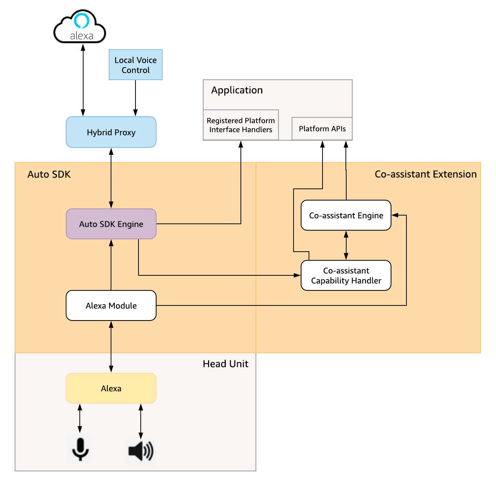
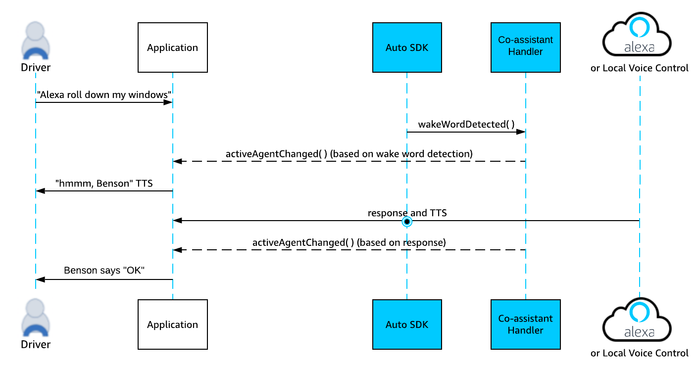

# Co-assistant Extension

The Alexa Auto SDK Co-assistant extension allows you to create and deploy your own branded voice assistant on the same Alexa technology stack that Alexa uses. 

**Table of Contents**

* [Overview](#overview)
* [What's Included](#whats-included)
* [Co-assistant Extension Architecture](#co-assistant-extension-architecture)
* [Co-assistant Extension Sequence Diagram](#co-assistant-extension-sequence-diagram)
* [Getting Started with the Co-assistant Extension](#getting-started-with-the-co-assistant-extension)
* [Building the Auto SDK with the Co-assistant Extension](#building-the-auto-sdk-with-the-co-assistant-extension)
* [Implementing a Custom Co-assistant Handler](#implementing-a-custom-co-assistant-handler)

## Overview<a id = "overview"></a>

The Co-assistant extension allows you to develop a branded assistant that collaborates with Alexa. Users can seamlessly use Alexa or the branded assistant and benefit from the same rich, voice-forward experience that the Alexa services enable. Furthermore, each assistant is aware of the other and can seamlessly hand interactions over to the other as needed. 

## What's Included<a id = "whats-included"></a>

The Co-assistant extension is provided by your Amazon Solutions Architect (SA) as an archive named `co-assistant-[version].zip` and is structured as follows:

```
aac-sdk
└─ extensions
   └─ extras
      └─ co-assistant
         └─ meta-aac-extra-co-assistant
            ├─ conf
            ├─ recipes-aac
            ├─ recipes-avs
         ├─ modules
            └─ co-assistant
               └─ platform
         └─ platforms
            └─ android
```
The following components are included in the Co-assistant extension:

* **meta-aac-extra-co-assistant**: This directory contains the scripts that allow you to build the Co-assistant extension.
* **modules**: This directory contains the Alexa Auto SDK interfaces and source code for the co-assistant module.
* **platform**: This directory contains the Android platform implementation for the Co-assistant extension.

## Co-assistant Extension Architecture<a id = "co-assistant-extension-architecture"></a>
The following diagram provides a high-level view of how the Co-assistant extension interacts with the Auto SDK and your application.



## Co-assistant Extension Sequence Diagram <a id ="co-assistant-extension-sequence-diagram"></a>
The following diagram illustrates a sample co-assistant sequence.



## Getting Started with the Co-assistant Extension<a id = "getting-started-with-the-co-assistant-extension"></a>

Before you get started, you should have a discussion with your SA about the overall process. Specifically, have a discussion about what existing domains will be available to your assistant and how these domains might overlap with Alexa, so you can plan for which custom skills you will develop in step 5.

Your SA will be your guide as you follow these steps to create a branded assistant.

1. Integrate the Alexa Auto SDK, including the Co-assistant extension, with your Alexa implementation. This step includes [building the Auto SDK with the Co-assistant extension](#building-the-auto-sdk-with-the-co-assistant-extension) and [implementing a custom Co-assistant handler](#implementing-a-custom-co-assistant-handler). 

2. Work with your SA to get your user accounts and devices whitelisted for evaluation of the pre-packaged "Benson" assistant. Metaphorically speaking, this is the co-assistant's "Demo mode".
3. Evaluate the pre-packaged Benson assistant using your platform implementation.

    >**Note:** Once you are done evaluating the pre-packaged Benson assistant, we can transition your implementation out of "Demo Mode".  You can continue using "Benson" as a wake word, but the system will direct this invocation to a new assistant configured for you. Step 4 describes how you can transition to a new wake word.

4. Amazon will develop your custom wake word for you. Please work with your Business Development and Solutions Architect for terms and details about the process.
5. Develop custom skills via the [Alexa Skills Kit (ASK) portal](https://developer.amazon.com/docs/ask-overviews/build-skills-with-the-alexa-skills-kit.html) and notify your SA of the skills you have deployed. Your SA will ensure your skills get marked for use with just your branded assistant.

    >**Note:** You may also want to define editorial responses (for example; "Benson, Good Morning" or "Benson, tell me a joke") and submit these to your SA. It is important that you pre-plan this effort with your SA to ensure we can provide you with the latest tools and guide you through the nuances of editorials.

6. Select an existing Amazon Web Services (AWS) Polly voice or discuss with your SA how Amazon can help you create a custom voice.

## Building the Auto SDK with the Co-assistant Extension<a id = "building-the-auto-sdk-with-the-co-assistant-extension"></a>

>**Note:** This section describes how to build the Auto SDK with the Co-assistant extension. In addition, you need to build the Auto SDK with the Local Voice Control (LVC) extension. For details, see the LVC extension README. 

### General Build Requirements
You can build the Alexa Auto SDK with the Co-assistant extension on a Linux, Unix, or macOS host of your choice. However, we recommend and support running a Docker environment with the following configuration.

* macOS Sierra or Ubuntu 16.04 LTS
* Processor: 2.5 GHz
* Memory: 16 Gb
* Storage: 1 Gb+ available to use.

### Supported Target Platforms

The Alexa Auto SDK is supported on the following platforms:

* Android 5.1 Lollipop API Level 22 or higher.
    * ARMv7a (+NEON)
    * AArch64
    * x86 32-bit
    * x86 64-bit
* Generic Linux
    * x86 64-bit
* Poky Linux
    * ARMv7a (+NEON)
    * AArch64 (including Automotive Grade Linux (AGL))

### Device Requirements

#### Android

* 1GB RAM for the LVC APK
* 2GB storage for the application and its runtime cache + 1GB per locale for the LVC APK
* Android NDK r20

#### Linux

* 1GB RAM for the LVC process
* 1GB storage for application and its runtime cache + 1GB per locale for the LVC APK


### Build Procedure

To build the Auto SDK with the Co-assistant extension, follow these steps:

1. Unzip the `co-assistant-[version].zip` archive into the `aac-sdk/extensions/extras` directory. 

    For example:
`unzip co-assistant-1.0.zip -d aac-sdk/extensions/extras/co-assistant`

    >**NOTE**: If the archive is already unzipped, simply move the `co-assistant` directory into the 'aac-sdk/extensions/extras` directory.


2. Use the Alexa Auto SDK builder script to build the Auto SDK with the `co-assistant` extension.

  To build for all Android targets, for example, use the following command:

  ```
builder/build.sh android extensions/extras/co-assistant
```

  Confirm that the Alexa Auto SDK Builder has added the extension by looking for the following lines in the initial console output:

 ```
NOTE: Search for sub modules: /home/builder/aac/extensions/extras/co-assistant
NOTE: Adding modules: /home/builder/aac/extensions/extras/co-assistant/modules
NOTE: Adding meta layer: /home/builder/aac/extensions/extras/co-assistant/meta-aac-co-assistant
```

#### For Android Targets

Create the platform AAR for the `co-assistant` extension module.

For example:

```
builder/build.sh gradle extensions/extras/co-assistant
```
## Implementing a Custom Co-assistant Handler<a id = "implementing-a-custom-co-assistant-handler"></a>

To implement a custom Co-assistant handler, extend the `CoAssistant` class to notify the application when the active agent is changed:

```
public class MyCoAssistantHandler extends CoAssistant {

    @Override
    public void activeAgentChanged(String agent) {
        // Notify the application that active agent is now changed.
	    // Application can use this information to update the UI etc.
    }

}

```

To enable Co-assistant capability, your platform implementation must instantiate and register this instance with the Engine by calling the  `registerPlatformInterface()` method on the Engine. For example:

```
engine->registerPlatformInterface( std::make_shared<MyCoAssistantHandler>());
```