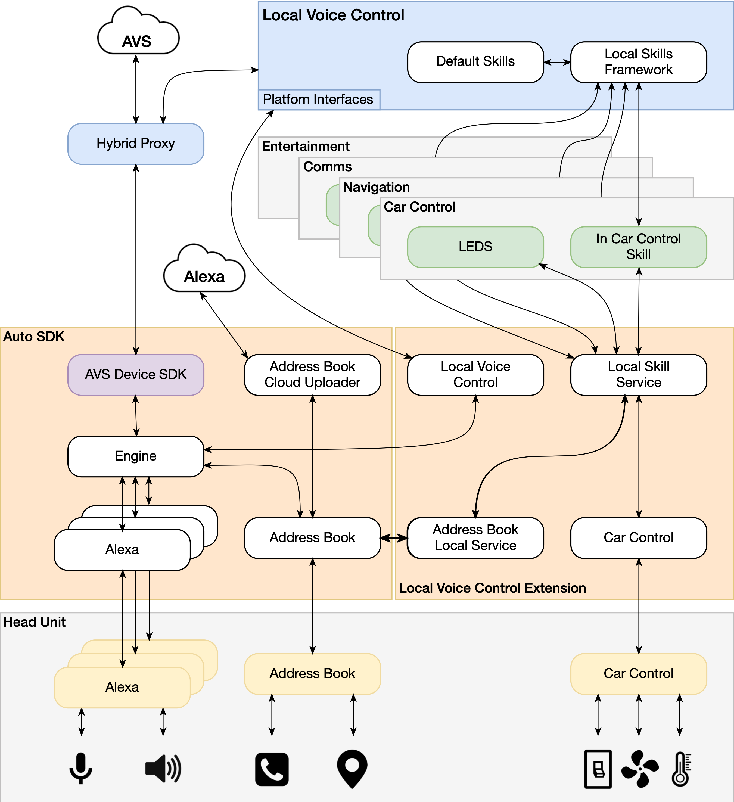
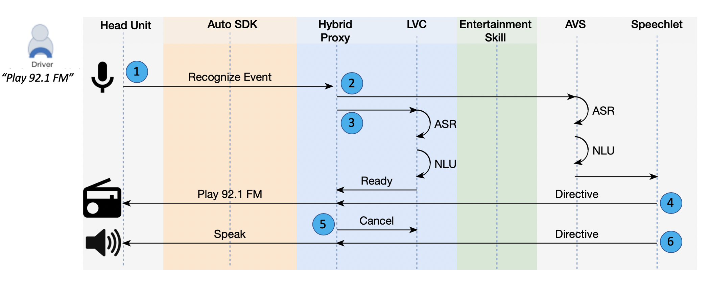
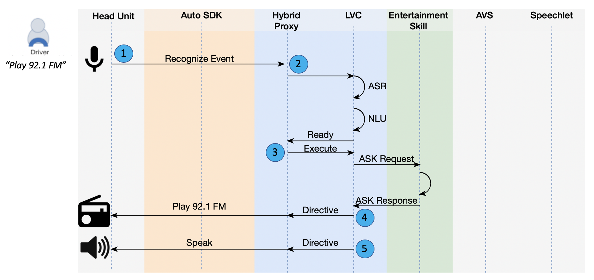
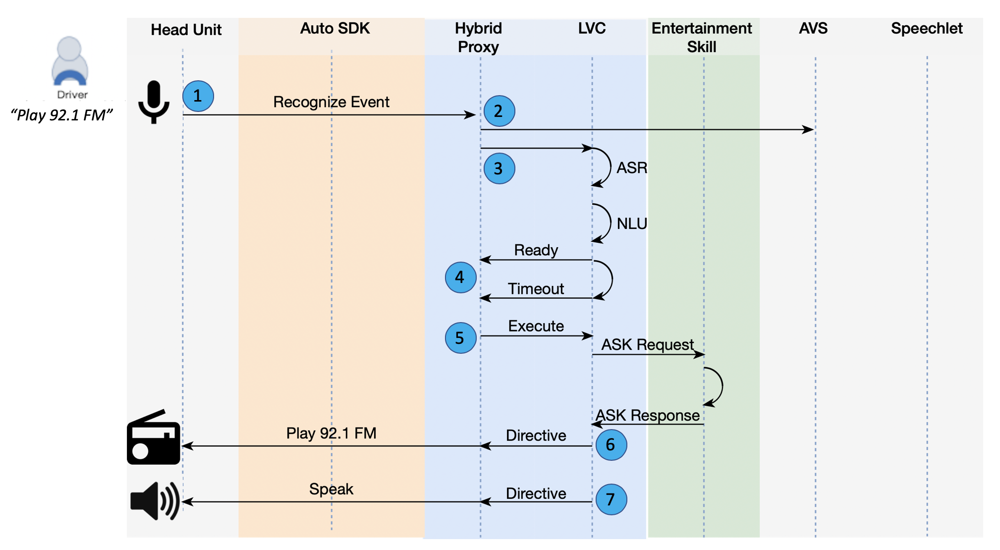

# Local Voice Control Extension

The Local Voice Control extension enhances the Alexa Auto experience by providing voice-based car control, entertainment, navigation, and communication whether connected to the internet or not. 
> **Note**: This version of the Local Voice Control extension is compatible with Alexa Auto SDK 2.0 and above.

**Table of Contents**:

* [Overview](#overview)
* [What's Included](#whatsincluded)
* [Local Voice Control Extension Architecture](#lvcarchitecture)
* [Local Voice Control Entertainment Sequence Diagrams](#entertainment-sd)
* [General Build Requirements](#generalbuildreqs)
* [Building the Alexa Auto SDK with the Local Voice Control Extension](#buildthesdkwithlvc)

## Overview<a id = "overview"></a>

The Local Voice Control extension works in conjunction with the on-device Local Voice Control software platform, which provides an Alexa endpoint that runs inside the car's head unit. The capabilities of the Local Voice Control platform are executed by local skills. When online, the user has access to the standard cloud-based Alexa capabilities as well as car control. When offline only capabilities supported by the local skills are available.

In this version, the LVC extension provides access to the following capabilities: entertainment, navigation, communication, and car control.

## What's Included<a id="whatsincluded"></a>
The following components are included in the Local Voice Control Extension:

* **meta-aac-local-voice-control**: This directory contains the scripts that allow you to build modules for a variety of hardware targets. It includes the Local Voice Engine archive: `local-voice-engine-[version].tar.gz`

* **modules**: This directory contains the Alexa Auto SDK interfaces and source code for the following modules:
    * [Address Book Local Service](./modules/address-book-local-service/README.md)
    * [Car Control](./modules/car-control/README.md)
    * [Local Skill Service](./modules/local-skill-service/README.md)
    * [Local Voice Control](./modules/local-voice-control/README.md)
* **platform**: This directory contains the Android platform implementation for the different modules of this extension.

The Local Voice Control extension is provided by your Amazon Solutions Architect (SA) or Partner Manager as an archive named  `local-voice-control-2.0.zip` and is structured as follows:

```
aac-sdk
└─ extensions
   └─ extras
      └─ local-voice-control
         ├─ assets
         │  └─ config-lvc.json
         ├─ meta-aac-local-voice-control
         │  └─ packages
         │     └─ local-voice-engine-[version].tar.gz
         ├─ modules
         │  ├─ address-book-local-service
         │  ├─ car-control
         │  ├─ local-skill-service
         │  └─ local-voice-control
         ├─ platforms
         │  └─ android
         │     └─ modules
         │        ├─ address-book-local-service
         │        ├─ car-control
         │        ├─ local-skill-service
         │        └─ local-voice-control
         ├─ CMakeLists.txt
         ├─ LICENSE
         ├─ LVC-Android.md
         ├─ LVC-Linux.md
         └─ package.sh
```


> **Note**: In order for the different capabilities to work as expected when online, be sure to have your device whitelisted. For details, please contact your SA.

## Local Voice Control Extension Architecture<a id="lvcarchitecture"></a>

The Local Voice Control Extension includes the necessary modules to support Local Voice Control, an on-device software platform resembling the end-to-end Alexa cloud, with local Alexa Speech Recognition (ASR), Natural Language Understanding (NLU), Text-To-Speech (TTS) and skills execution capabilities. Local Voice Control enhances the user experience by leveraging a local Alexa to improve resiliency (offline support) and reducing User Perceived Latency (UPL).

<p align="center">

</p>

The modules of the Local Voice Control Extension include:

### Local Voice Control Module
This module implements the platform-specific support for Local Voice Control. The application is required to pass Engine configuration parameters as outlined in the Local Voice Control module documentation for [Linux](./modules/local-voice-control/README.md) or [Android](./platforms/android/modules/local-voice-control/README.md).

### Local Skill Service Module
This module provides a unified entry point for all services that local skills can use. The application is required to pass Engine configuration parameters as outlined in the Local Skill Service module documentation for [Linux](./modules/local-skill-service/README.md) or [Android](./platforms/android/modules/local-skill-service/README.md). This module does not expose platform interfaces.

### Address Book Local Service Module
This module provides access to the available contacts and favorite addresses in the Contacts service. It uses the Address Book platform interfaces to retrieve address book entries as outlined in the Address Book module documentation for [Linux](./modules/address-book-local-service/README.md) or [Android](./platforms/android/modules/address-book-local-service/README.md). The communication and navigation skills can then use this information to call a contact or navigate to a favorite address. This module does not expose platform interfaces.

### Car Control Module
This module provides platform interfaces to control vehicle components. It features a generic set of controllers that represent what can be controlled in a vehicle; for example: interior lighting, fans, temperature zone (driver and passenger), vent position, defroster, air conditioner, and recirculation. The application is required to pass Engine configuration parameters and register a platform interface implementation as outlined in the Car Control module documentation for [Linux](./modules/car-control/README.md) or [Android](./platforms/android/modules/car-control/README.md).

## Local Voice Control Example Sequence Diagrams<a id="entertainment-sd"></a>

To demonstrate the execution flow of Local Voice Control within Auto SDK, the following diagrams illustrate a sample entertainment sequence based on the utterance "play 92.1 FM" in three different ways: cloud (when online), local (when offline), and cloud timeout (when online but connection is poor).

#### Cloud Handling Sequence Diagram
The following diagram illustrates a sample online entertainment sequence based on the utterance "play 92.1 FM". It shows a scenario in which the device is known to be online with good connection and is connected to both the cloud and LVC. LVC and cloud handle the request simultaneously with preference given to the cloud response.
<p align="center">

</p>

1. The Hybrid Proxy sends a Recognize event to both LVC (local) and AVS (cloud).
2. AVS processes the request (ASR+NLU), creates the intent, and calls the associated Speechlet.
3. LVC processes the request (ASR+NLU), creates the intent, and waits for its execution.
4. AVS returns a directive to play 92.1 FM.
5. The Hybrid Proxy notifies LVC to cancel the prepared intent.
6. AVS sends the Speak directive: “Playing 92.1 FM”.

#### Local Handling Sequence Diagram
The following diagram illustrates a sample offline entertainment sequence based on the utterance "play 92.1 FM". It shows a scenario in which the device is known to be offline and therefore not connected to the cloud at all and only connected to LVC. LVC handles the request immediately.
<p align="center">

</p>

1. The Hybrid Proxy knows there is no connection to AVS. It sends a Recognize event to LVC (local) only.
2. LVC processes the request (ASR+NLU), creates the intent and waits for its execution.
3. The Hybrid Proxy notifies LVC to execute the prepared intent.
4. LVC returns a directive to play 92.1 FM.
5. LVC sends the Speak directive: “Playing 92.1 FM”.

#### Local Handling with Cloud Timout Sequence Diagram
The following diagram illustrates a sample cloud timeout entertainment sequence based on the utterance "play 92.1 FM". It shows a scenario in which the device has a spotty connection. It is connected to both the cloud and LVC, but communication with the cloud may be interrupted or slow, so LVC takes over in the absence of timely cloud responses.
<p align="center">

</p>

1. The Hybrid Proxy sends a Recognize event to both LVC (local) and AVS (cloud).
2. AVS processes the request (ASR+NLU), creates the intent, and calls the associated Speechlet.
3. LVC processes the request (ASR+NLU), creates the intent and waits for its execution.
4. The Hybrid Proxy waits for the AVS response until a timeout is reached.
5. The Hybrid Proxy notifies LVC to execute the prepared intent.
6. LVC returns a directive to play 92.1 FM.
7. LVC sends the Speak directive: “Playing 92.1 FM”.  
 Eventually subsequent AVS responses to the Recognize event are discarded.

## General Build Requirements<a id="generalbuildreqs"></a>

You can build the Alexa Auto SDK with the Local Voice Control extension on a Linux, Unix, or macOS host of your choice. However, we recommend and support running a Docker environment with the following configuration.

* macOS Sierra or Ubuntu 16.04 LTS
* Processor: 2.5 GHz
* Memory: 16 Gb
* Storage: 1 Gb+ available to use.

### Supported Target Platforms

The Alexa Auto SDK is supported on the following platforms:

* Android 5.1 Lollipop API Level 22 or higher.
    * ARMv7a (+NEON)
    * AArch64
    * x86 64-bit
* Generic Linux
    * x86 64-bit
* Poky Linux
    * ARMv7a (+NEON)
    * AArch64 (including Automotive Grade Linux (AGL))

### Device Requirements

#### Android

* 1GB RAM for the LVC APK
* 2GB storage for the application and its runtime cache + 1GB per locale for the LVC APK
* Android NDK r20

#### Linux

* 1GB RAM for the LVC process
* 1GB storage for application and its runtime cache + 1GB per locale for the LVC APK

### Build Dependencies

The Local Voice Control Extension resources include the prebuilt archive `local-voice-engine-[version].tar.gz`.
This archive provides the Local Voice Engine libraries and headers needed to build the Local Voice Control module.

## Building the Alexa Auto SDK with the Local Voice Control Extension<a id="buildthesdkwithlvc"></a>

>**Note:** Prior to building the Alexa Auto SDK with the Local Voice Control extension, you should read and understand the instructions in the Auto SDK [Builder README](./builder/README.md).

Unzip the `local-voice-control-[version].zip` archive into the `${AAC_SDK_HOME}/extensions/extras` directory. For example:
  
```
unzip local-voice-control-2.0.zip -d ${AAC_SDK_HOME}/aac-sdk/extensions/extras
```

> **Note**: If the archive is already unzipped, move the `local-voice-control` directory into the `aac-sdk/extensions/extras` directory.

> **Note**: Do not extract the local-voice-engine archive.

After you have unzipped the `local-voice-control-[version].zip` archive into the `${AAC_SDK_HOME}/extensions/extras` directory, run the appropriate build command, additionally specifying the path to the extension. To build for Linux x86 64-bit, for example, use the following command:

```
builder/build.sh native -t native extensions/extras/local-voice-control
```
The [Building an Alexa Auto SDK Android Application with Local Voice Control](LVC-Android.md) and [Building an Alexa Auto SDK Linux Application with Local Voice Control](LVC-Linux.md) documents provide platform-specific information.

### Using LVC on Android <a id="lvc-for-android"></a>

See the [Building an Alexa Auto SDK Android Application with Local Voice Control](LVC-Android.md) document for details about LVC packaging on Android, using the Android sample app with LVC, and implementation requirements for your own LVC-enabled Auto SDK application.

### Using LVC on Linux<a id="lvc-for-linux"></a>

See the [Building an Alexa Auto SDK Linux Application with Local Voice Control](LVC-Linux.md) document for details about LVC packaging on Linux, using the C++ sample app with LVC, and implementation requirements for your own LVC-enabled Auto SDK application.
