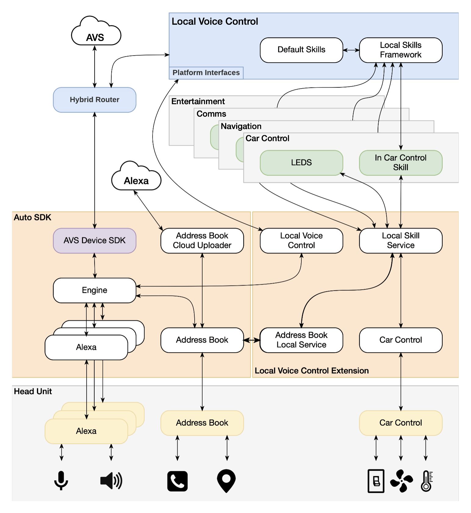

# Local Voice Control Extension

The Local Voice Control extension enhances the Alexa Auto experience by providing voice-based car control, entertainment, local search, navigation, and phone calling whether connected to the internet or not.

<!-- omit in toc -->
## Table of Contents
- [Overview](#overview)
- [What's Included](#whats-included)
- [Modules in Local Voice Control Extension](#modules-in-local-voice-control-extension)
  - [Local Voice Control Module](#local-voice-control-module)
  - [Local Skill Service Module](#local-skill-service-module)
  - [Address Book Local Service Module](#address-book-local-service-module)
  - [Car Control Local Service Module](#car-control-local-service-module)
  - [Local Navigation Module](#local-navigation-module)
- [Local Voice Control Extension Architecture](#local-voice-control-extension-architecture)
- [General Build Requirements](#general-build-requirements)
  - [Supported Target Platforms](#supported-target-platforms)
  - [Device Requirements](#device-requirements)
  - [Build Dependencies](#build-dependencies)
- [Building the Alexa Auto SDK with the Local Voice Control Extension](#building-the-alexa-auto-sdk-with-the-local-voice-control-extension)
  - [Using LVC on Android](#using-lvc-on-android)
  - [Using LVC on Linux](#using-lvc-on-linux)

## Overview

The Local Voice Control extension works in conjunction with the on-device Local Voice Control (LVC) software, which provides an Alexa endpoint that runs inside the car's head unit. LVC enhances the user experience with improved resiliency and reduced user-perceived latency by providing local Automatic Speech Recognition (ASR), Natural Language Understanding (NLU), Text-to-Speech (TTS), and skill execution functionality resembling the Alexa Voice Service (AVS). When connected to the internet, the user can use the standard Alexa capabilities. Without internet access, only capabilities supported by the local skills and services are available.

Before you can use the LVC extension, download and install the on-device LVC software separately according to instructions in the Local Voice Control module documentation for [Linux](./modules/local-voice-control/README.md) or [Android](./platforms/android/modules/local-voice-control/README.md).

>**Note:** If you use the Local Voice Control extension, you must register an implementation of the `NetworkInfoProvider` platform interface that monitors network connection and reports the network state to the Engine.

## What's Included
The following components are included in the Local Voice Control extension:

* **meta-aac-local-voice-control**: This directory contains the scripts that build modules for various hardware targets. It includes archives containing libraries the Auto SDK Engine needs for LVC: `local-voice-engine-[version].tar.gz`, `hr-[version].tar.gz`, and `local-poi-service-[version].tar.gz`.

* **modules**: This directory contains the Alexa Auto SDK interfaces and source code for the modules.

* **platforms/android**: This directory contains the Android platform implementation for the different modules of this extension.

The Local Voice Control extension is provided by your Amazon Solutions Architect (SA) or Partner Manager as an archive named `local-voice-control-[version].zip` and is structured as follows:

```
aac-sdk
└─ extensions
   └─ extras
      └─ local-voice-control
         ├─ assets
         │  └─ config-lvc.json
         ├─ meta-aac-local-voice-control
         │  └─ packages
         │     └─ local-voice-engine-[version].tar.gz
         │     └─ hr-[version].tar.gz
         │     └─ local-poi-service-[version].tar.gz
         |
         ├─ modules
         │  ├─ address-book-local-service
         │  ├─ car-control-local-service
         │  ├─ local-navigation
         │  ├─ local-skill-service
         │  └─ local-voice-control
         ├─ platforms
         │  └─ android
         │     └─ modules
         │        ├─ address-book-local-service
         │        ├─ car-control-local-service
         │        ├─ local-navigation
         │        ├─ local-skill-service
         │        └─ local-voice-control
         ├─ CMakeLists.txt
         ├─ LICENSE
         ├─ LVC-Android.md
         ├─ LVC-Linux.md
         └─ package.sh
```

## Modules in Local Voice Control Extension
The Local Voice Control extension include the following modules:

### Local Voice Control Module
The Local Voice Control module augments the Engine with a component called Hybrid Router, which acts as a proxy between the two Alexa endpoints (AVS and LVC). The Hybrid Router performs these functions:
* establishing and maintaining the connection to the LVC Alexa endpoint over a Unix Domain Socket (UDS)
* sending events to and receiving directives from both Alexa endpoints
* deciding which Alexa endpoint should execute the response to a user request

The Local Voice Control module also provides information (e.g., device locale setting and internet connection state) to LVC by bridging between LVC and the platform interfaces implemented with the default modules in the Auto SDK. This module does not include platform interfaces of its own but does require the application to pass Engine configuration parameters, as outlined in the Local Voice Control module documentation for [Linux](./modules/local-voice-control/README.md) or [Android](./platforms/android/modules/local-voice-control/README.md).

### Local Skill Service Module
The Local Skill Service module provides a multipurpose Engine service called "Local Skill Service," which is an HTTP-over-UDS endpoint for several connections between the Engine and skills or services running in LVC. This module does not include platform interfaces of its own but does require the application to pass Engine configuration parameters, as outlined in the Local Skill Service module documentation for [Linux](./modules/local-skill-service/README.md) or [Android](./platforms/android/modules/local-skill-service/README.md).

### Address Book Local Service Module
The Address Book Local Service module enables the user, while offline, to call contacts and navigate to favorite addresses. The module uses the Local Skill Service to bridge between the LVC local contacts service and the Auto SDK Address Book module. This module does not include platform interfaces or configuration of its own and instead uses the Address Book module platform interface to retrieve address book entries, as outlined in the Address Book Local Service module documentation for [Linux](./modules/address-book-local-service/README.md) or [Android](./platforms/android/modules/address-book-local-service/README.md).

### Car Control Local Service Module
The Car Control Local Service module enables offline car control by using the Local Skill Service to bridge between the local car control skill and endpoint discovery service running in LVC and the Auto SDK Car Control module. This module does not include platform interfaces or configuration of its own and instead uses the Car Control module platform interface to adjust settings of the configured vehicle endpoints, such as interior lights and fans, as outlined in the README file for the Car Control module in the Auto SDK.

### Local Navigation Module
The Local Navigation module enables users to use Alexa local search and navigation without WiFi or data plan connectivity, as outlined in the Local Navigation module documentation for [Linux](./modules/local-navigation/README.md) or [Android](./platforms/android/modules/local-navigation/README.md).

## Local Voice Control Extension Architecture

<p align="center">

</p>

## General Build Requirements

You can build the Alexa Auto SDK with the Local Voice Control extension on a Linux, Unix, or macOS host of your choice. However, we recommend and support running a Docker environment with the following configuration.

* macOS Sierra or Ubuntu 16.04 LTS
* Processor: 2.5 GHz
* Memory: 16 Gb
* Storage: 1 Gb+ available to use.

### Supported Target Platforms

The Alexa Auto SDK is supported on the following platforms:

* Android 5.1 Lollipop API Level 22 or higher.
    * AArch64
    * x86 64-bit
* Generic Linux
    * x86 64-bit
* Poky Linux
    * ARMv7a (+NEON)
    * AArch64

### Device Requirements

#### Android

* 1GB RAM for the LVC APK
* 2GB storage for the application and its runtime cache + 1GB per locale for the LVC APK
* Android NDK r20

#### Linux

* 1GB RAM for the LVC process
* 1GB storage for application and its runtime cache + 1GB per locale for the LVC APK

### Build Dependencies

The Local Voice Control Extension resources include the prebuilt archive `local-voice-engine-[version].tar.gz`.
This archive provides the Local Voice Engine libraries and headers needed to build the Local Voice Control module.

## Building the Alexa Auto SDK with the Local Voice Control Extension

>**Note:** Prior to building the Alexa Auto SDK with the Local Voice Control extension, you should read and understand the instructions in the Auto SDK [Builder README](./builder/README.md).

Unzip the `local-voice-control-[version].zip` archive into the `${AAC_SDK_HOME}/extensions/extras` directory. For example:
  
```
unzip local-voice-control-2.0.zip -d ${AAC_SDK_HOME}/aac-sdk/extensions/extras
```

> **Note**: If the archive is already unzipped, move the `local-voice-control` directory into the `aac-sdk/extensions/extras` directory.

> **Note**: Do not extract the local-voice-engine archive.

After you have unzipped the `local-voice-control-[version].zip` archive into the `${AAC_SDK_HOME}/extensions/extras` directory, run the appropriate build command, additionally specifying the path to the extension. To build for Linux x86 64-bit, for example, use the following command:

```
builder/build.sh linux -t native extensions/extras/local-voice-control
```
The [Building an Alexa Auto SDK Android Application with Local Voice Control](LVC-Android.md) and [Building an Alexa Auto SDK Linux Application with Local Voice Control](LVC-Linux.md) documents provide platform-specific information.

### Using LVC on Android

See the [Building an Alexa Auto SDK Android Application with Local Voice Control](LVC-Android.md) document for details about LVC packaging on Android, using the Android sample app with LVC, and implementation requirements for your own LVC-enabled Auto SDK application.

### Using LVC on Linux

See the [Building an Alexa Auto SDK Linux Application with Local Voice Control](LVC-Linux.md) document for details about LVC packaging on Linux, using the C++ sample app with LVC, and implementation requirements for your own LVC-enabled Auto SDK application.
