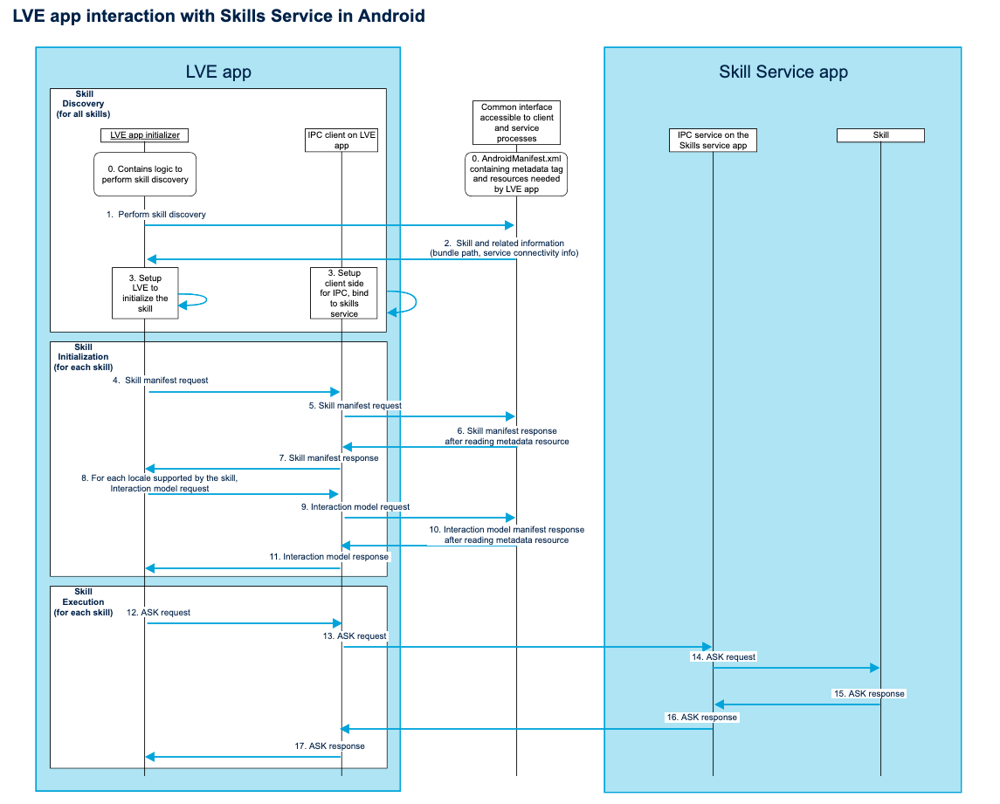
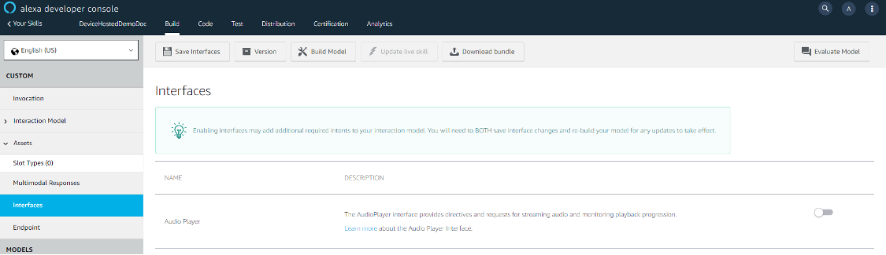
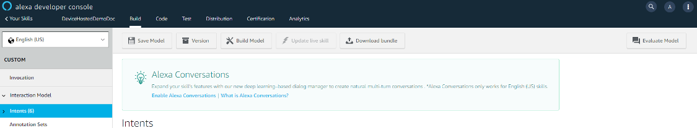
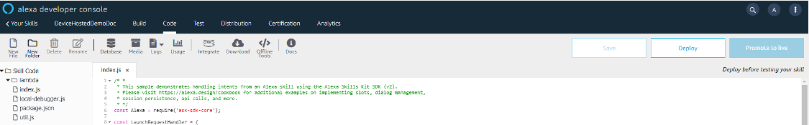
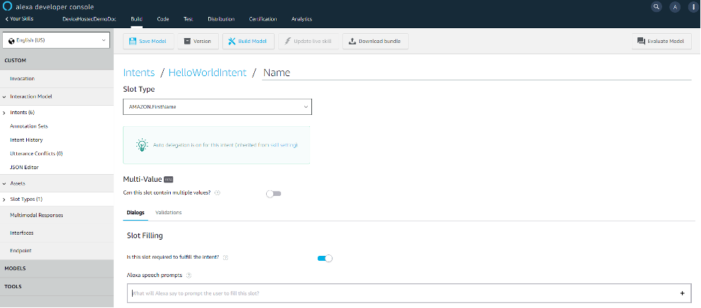
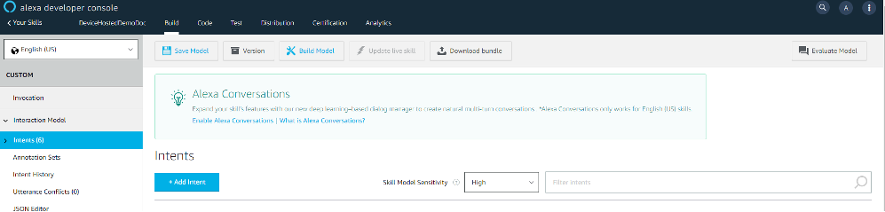

# Device Hosted Skills Extension
The Device Hosted Skills extension enables you to develop skills that run locally on your device.

<!-- omit in toc -->
## Table of Contents
- [Overview](#overview)
- [Prerequisites](#prerequisites)
- [Glossary](#glossary)
- [Different Approaches for Android-based Skill Development](#different-approaches-for-android-based-skill-development)
  - [Device Hosted Skills Service for Android](#device-hosted-skills-service-for-android)
  - [Device Hosted Skills Using Node.js](#device-hosted-skills-using-nodejs)
- [Quick Start for Demo Skill based on the NodeJS approach](#quick-start-for-demo-skill-based-on-the-nodejs-approach)
- [Detailed Steps for Developing Skills Service on Android](#detailed-steps-for-developing-skills-service-on-android)
  - [Building and Downloading the Skill Bundle, Skill Manifest, and Skill Interaction Model](#building-and-downloading-the-skill-bundle-skill-manifest-and-skill-interaction-model)
  - [Building the Skill Code](#building-the-skill-code)
    - [Creating Skills Service - Contract with LVC](#creating-skills-service---contract-with-lvc)
  - [Building and Downloading the skill bundle](#building-and-downloading-the-skill-bundle)
    - [Using the ASK Developer Console](#using-the-ask-developer-console)
    - [Using the ASK CLI](#using-the-ask-cli)
  - [Running the Skills Service on Android](#running-the-skills-service-on-android)
- [Detailed Steps for Developing a Skill Using Node.js](#detailed-steps-for-developing-a-skill-using-nodejs)
  - [Building the Interaction Model](#building-the-interaction-model)
  - [Building the Runtime Facade](#building-the-runtime-facade)
  - [Building Device Hosted Skill Container](#building-device-hosted-skill-container)
  - [Configuring Local Voice Control](#configuring-local-voice-control)
- [Running Device Hosted Skill using the NodeJS runtime](#running-device-hosted-skill-using-the-nodejs-runtime)
- [Best Practices](#best-practices)
- [Troubleshooting](#troubleshooting)
## Overview
The Device Hosted Skills extension supports  the en-US and de-DE locales. 

For the en-US locale, the built-in slot types supported are:

* AMAZON.NUMBER 
* AMAZON.SearchQuery
* AMAZON.PhoneNumber
* AMAZON.US_FIRST_NAME 
* AMAZON.US_CITY
* AMAZON.FOUR_NUMBER_DIGIT
* AMAZON.US_STATE
* AMAZON.Ordinal

For the de-DE locale, the built-in slot types supported are:

* AMAZON.NUMBER 
* AMAZON.DATE
* AMAZON.SearchQuery
* AMAZON.DE_FIRST_NAME
* AMAZON.TIME
* AMAZON.DE_CITY

The extension also supports multi-turn and progressive responses.
>**Note:** All `locale` usage should follow these specifications: [Tags for Identifying Languages](https://datatracker.ietf.org/doc/html/rfc5646). E.g. en-US, de-DE and so on.

## Prerequisites
You must have the following items ready before building your device hosted skill:

* Device hosted skills development workflow on the Alexa developer console. Contact your Solutions Architect or Partner Manager for information about accessing the workflow.
* The following packages:
  * Alexa Auto SDK 3.2 or later on GitHub
  * Auto SDK Local Voice Control extension on the AVS developer portal
  * Auto SDK Custom Assistant extension on the AVS developer portal
  * Device Hosted Skills extension, which contains all artifacts needed for building device hosted skills, on the AVS developer portal
* Supported build environments:
  * Android arm64-based or x86_64-based devices as supported by the Auto SDK
  * Docker hosts that support Linux guest containers
  * Linux environment with Android NDK revision 21 or later, Android API level 23 or later, and GCC version 6.3 or later

## Glossary
The following table explains terms used in this document that you need to understand before developing device hosted skills.

| Term | Meaning
|-|-|
|Node.js Facade |A skill facade contains the logic for interfacing with the Node.js runtime. The Node.js facade is responsible for Javascript code execution. It has a runtime and build time dependency on `libnode.so` built during the skill development lifecycle.
|Skill Container |A skill container manages a set of skills.
|DeviceHostedRemoteSkillContainer (For Android only) | The skill container distribution contains the shared objects required to start up a skill container. It is a Java package that uses JNI to manage the startup stages of skill containers for the given remote skill configuration. 
| Remote Skill Container Configuration | The configuration file contains metadata about the skills loaded in the remote skill container.
| Skill Model Bundle | Downloaded from the Alexa developer console, the bundle contains the necessary models for the skill.
| Skill Code Bundle | Downloaded from the Alexa developer console, the bundle contains the skill interaction model and Javascript skill code.
| Progressive response | It is interstitial Speech Synthesis Markup Language (SSML) content (including text-to-speech and short audio) that Alexa plays while waiting for your full skill response.
| Device Hosted Skills Service |An Android application component that runs skills independent of the LVC app.

## Different Approaches for Android-based Skill Development
The following sections describe different approaches for creating device hosted skills:

### Device Hosted Skills Service for Android
You can create an Android service to run on your device, which includes multiple skills. This service is called device hosted skills service. It uses Android features along with certain Alexa Skill Kit (ASK) interfacing contracts to run your skills. This essentially allows you to separate the skill code from the engine that supports the execution of the skill.

The skills service would be a part of an Android application that is independent of the LVC application. The service only interacts with LVC through Android binder IPC (Inter-Process Communication).

A skill in the skills service consists of the following parts:

* The skill artifact model bundle (also called "skill models" or "skill bundle"), the skill manifest, and the skill interaction model work together to resolve the user’s utterance to a format that the skill code understands.
  >**Note:** The skill manifest is unrelated to the Android manifest.
* The skill code takes the result of the skill code takes the result of utterance processing, which is an ASK request, and provides an ASK response. This ASK response dictates to LVC what actions to take like spoken output or specific directives.

### Device Hosted Skills Using Node.js
You can create device hosted skills by using the Node.js facade. This approach requires that the skills be connected to LVC and that you configure LVC, as described in the [configuration section](#configuring-local-voice-control). 

## Quick Start for Demo Skill based on the NodeJS approach
This section describes how to access pre-built artifacts for arm64-based Android devices to run a demo skill called DeviceHostedDemoSkill. These pre-built artifacts enable you to  familiarize yourself with a device hosted skill.

Before you begin, download `Quick-Start.tar.gz` from the Device Hosted Skills extension on the AVS developer console to access the artifacts. 

> **Note:** The pre-built artifacts are only for demo purposes. You must replace pre-built artifacts with your own versions signed with your developer key.

1) Install the Skill Container,  `DeviceHostedDemoSkill.apk`, by entering the following command:
   
    `adb install DeviceHostedDemoSkill.apk`
    
2) Install `lveapp-release-signed.apk` by entering the following command: 
 
    `adb install lveapp-release-signed.apk`
  
3) Install `lmapp-en_US-release-signed.apk` by entering the following command:
   
   `adb install lmapp-en_US-release-signed.apk`

   >**Note:** The APK shown in this step is for the en-US locale only. In the actual step, install the APK appropriate to your locale. 

4) Install the Auto SDK sample app by entering the following command:

    `adb install com.amazon.sampleapp.apk`
  
5) Push `autoSDKSampleAppExtraConfig.json` to the device by entering the following command:

    `adb push autoSDKSampleAppExtraConfig.json /mnt/sdcard/`
  
6) Launch the Skill Container by clicking the `DeviceHostedDemoSkill` icon on your device.
 
7) Accept `Disk permissions` to allow `DeviceHostedDemoSkill` to write to the disk. On successful startup, the application displays the following message:
   
   `Successfully started the skill container!`

8) Launch the Sample App by clicking  the `SampleApp` icon on your device.

9) Accept permissions for access to `Device Location`, `Files`, and `Record Audio`. 

10) Use Login With Amazon (LWA) from the Sample App to get authorization. Then disable WiFi and data connection for the device to go offline.
    
    After Local Voice Control starts up, the Sample App displays CONNECTED as its status. This may take up to 30 seconds.
    
11) Speak to the Sample App to invoke the Device Hosted Demo Skill. Alternatively, press the Sample App's mic button to try demo skill utterances. The following examples show the utterances and the responses:
    * "Do you know Samantha?" "Samantha."
    * "Guess a number." "A number between zero and what?"
    * "How many people live in Ohio?" "Ohio."

## Detailed Steps for Developing Skills Service on Android
For details on how the LVE app interacts with the Skills Service app checkout this sequence diagram:
<p>

</p>

Creating the skills service to run device hosted skills involve the following steps:

1. Build and download the skill model, skill manifest, and skill interaction model.

2. Build the skills service.

### Building and downloading the Skill Bundle, Skill Manifest and Skill Interaction Model
Follow these steps to build the skill bundle, skill manifest and skill interaction model:

1. Create a skill on the Alexa developer console and choose an interaction model, as described in the [documentation for skill creation](https://developer.amazon.com/en-US/docs/alexa/devconsole/create-a-skill-and-choose-the-interaction-model.html). For the “Choose a method to host your skill's backend resources” field, select “Provision you own”.

2. Design and Build the skill using [Design Your Skill](https://developer.amazon.com/en-US/docs/alexa/design/design-your-skill.html) and [Build Your Skill](https://developer.amazon.com/en-US/docs/alexa/build/build-your-skill-overview.html).
   This step is same as designing and building any other ASK skill that would execute in the Cloud.

3. Enable `Device Hosted` feature, build and download the skill bundle. See section [Building and Downloading the skill bundle](#building-and-downloading-the-skill-bundle) for different options to perform this step.

4. Set up the ASK Command Line Interface (CLI) as described in the [ASK CLI documentation](https://developer.amazon.com/en-US/docs/alexa/smapi/quick-start-alexa-skills-kit-command-line-interface.html).
   
5. Use the ASK CLI to get the [interaction models](https://developer.amazon.com/en-US/docs/alexa/smapi/ask-cli-command-reference.html#get-interaction-model-subcommand) and [skill manifest](https://developer.amazon.com/en-US/docs/alexa/smapi/ask-cli-command-reference.html#get-skill-manifest-subcommand).
   > **Note:** If you are using the ASK CLI private build replace `ask smapi` to `node ask-cli-cr/bin/ask-smapi.js` in the above commands to download the interaction models and skill manifest.

Now you have the skill model, skill manifest, and interaction model ready for building the skill service.

### Building the Skills Service
The skill code will be part of the skills service.

Building the skill code involves creating the service contract required for LVC to interact with a skill. Follow these steps to build the skill code:

1. This reference skills service is defined using Android binder IPC. For information about binder IPC, see the [Android  binder IPC documentation](https://source.android.com/devices/architecture/hidl/binder-ipc). In addition, the IPC must use [Messenger](https://developer.android.com/reference/android/os/Messenger) and [Message](https://developer.android.com/reference/android/os/Message) defined with the [Standard Android Development Kit](https://developer.android.com/studio).

2. Develop the skill with [ASK SDK v2 for Java](https://developer.amazon.com/en-US/docs/alexa/alexa-skills-kit-sdk-for-java/overview.html). You can use any language as long as the skills service adheres to the ASK contracts.
   The request from LVC will be an [ASK request](https://developer.amazon.com/en-US/docs/alexa/custom-skills/request-and-response-json-reference.html#request-body-syntax) and LVC expects that an [ASK response](https://developer.amazon.com/en-US/docs/alexa/custom-skills/request-and-response-json-reference.html#response-body-syntax) is provided as a response based on the ASK request.

3. For each skill in the skills service, the service must include the skill manifest and interaction models. See section [Creating Skills Service - Contract with LVC](#creating-skills-service---contract-with-lvc) on how to include this

4. For each skill in the skills service, the service must provide the [ASK response](https://developer.amazon.com/en-US/docs/alexa/custom-skills/request-and-response-json-reference.html#response-body-syntax) to LVC upon receiving an [ASK request]((https://developer.amazon.com/en-US/docs/alexa/custom-skills/request-and-response-json-reference.html#request-body-syntax). This request-response workflow is facilitated by the Android binder IPC between LVC and the service.

    * If you use an ASK provided SDK in Java, no additional action is needed other that pulling the SDK as a dependency into your project. The [ASK SDK v2 for Java](https://developer.amazon.com/en-US/docs/alexa/alexa-skills-kit-sdk-for-java/overview.html) is included as part of this reference implementation.
    Download the `DeviceHostedReferenceSkillService.tar.gz` available on Device Hosted Extension on AVS developer portal. Decompress the tarball and load it as an Android project in Android Studio IDE. 
    The README.md file in that project should explain the setup required for running a skills service on Android platform.

    * If you do not use an ASK provided SDK, you must implement JSON parsers that read the request, implement the logic to perform the skill handling, create the expected response JSON, and return the response. You can use this reference implementation to understand the contracts and implement the skills any language that could have a runtime on an Android device.


#### Creating Skills Service - Contract with LVC
Below is the contract between LVC and Device Hosted Skills Services for Android. Reference implementations are provided in this package.

1. Define in `AndroidManifest.xml` a service with the `<intent-filter>` tag under the `<service>` tag definition, as shown in the following code. The block of code below is an example.

    ```
        <!-- Replace with your service package.name and label --> 
        <service android:name="com.amazon.alexa.SkillService"
                android:enabled="true"
                android:exported="true"
                android:permission="com.amazon.alexa.skill.permission.SEND_SKILL_REQUEST"
                android:label="@string/app_name"
                android:process=":remote">
                <intent-filter>
                    <action android:name="com.amazon.alexa.skill.INVOKE_SKILL" />
                </intent-filter>
        </service>
    ```
>**Note:** The <intent-filter> content has to be identical, the service name can be of your choice.

2. Include a `<meta-data>` tag into the `AndroidManifest.xml` within that `<application>` that declares a raw resource as follows (have to be identical):

    ```
        <meta-data android:name="com.amazon.speech.localskillendpoints"
                android:resource="@raw/local_skill_endpoints"/>
    ```

3. Define a raw resource as follows:

   a. Create a directory under the `res` directory called `raw`. If the `res` directory does not exist, create it in  `<project_dir>/src/main/`.

   b. Under the `raw` directory, create the `local-skill-endpoints` file, which defines all the skills in this skills service. The format of this file is as follows:
    ```
        {
            "local-skill-endpoints": [
                {
                    "skillEndpointId": "<ASK_SKILL_ID>",
                    "artifactBundle": {
                        "path": "/path/to/android/skill/bundle/"
                        "checksum": "<md5_hash_of_bundle>"
                    }
                },
                {
                    "skillEndpointId": "<ASK_SKILL_ID>",
                    "artifactBundle": {
                        "path": "/path/to/android/skill/bundle/"
                        "checksum": "<md5_hash_of_bundle>"
                    }
                },
            ]
        }
    ```

   >**Note:** `ASK_SKILL_ID` must match `skillId` used in the Alexa developer console.

   c. Store the skill bundle downloaded in the previous section in a path that is accessible on the device. Include this path as `path` in the JSON in the `raw` directory. Provide the absolute path to that bundle.

   d. Run `md5sum` on the skill bundle and include it as the `checksum` value. The following is an example of `md5sum` and its output:

   ```
       md5sum amzn1.ask.skill.bfee92c9-e425-4a7b-a3a9-ec63ce49b4df.tar.gz
      
       41fba2223e774e96c0161df7947b1c60  amzn1.ask.skill.bfee92c9-e425-4a7b-a3a9-ec63ce49b4df.tar.gz
   ```

4. Add each skill's manifest JSON as a file under the raw folder, similar to the local_skill_endpoints file. This file should contain the skill manifest JSON.

5. For each skill include a `<meta-data>` tag into the `AndroidManifest.xml` within that `<application>`. The name of the `<meta-data>` tag should be `<ASK_skill_id>-manifest`.
   This will allow the skill manifest to be read by LVC. The file name of the raw resource that holds the skill manifest can be of your choice. The expected format of this file is as follows:
    ```
        <meta-data android:name="<ASK_skill_id>-manifest"
                android:resource="@raw/file_name_containing_skill_manifest"/>
    ```

6. Add one file per skill per locale supported by the skill within the raw folder, similar to the skill manifest file. This file should contain the skill interaction model JSON.
   If the skill supports 3 locales then there should be 3 files, one for each locale that this skill supports.

   >**Note:** Therefore, if there are 2 skills with each supporting 3 locales the total number of raw files expected are 2(3 + 1) + 1 = 9.

7. For each skill and for each locale supported by the skill, include a `<meta-data>` tag into the `AndroidManifest.xml` within that `<application>`. The name of the `<meta-data>` tag should be `<ASK_skill_id>-<locale>`.
   This will allow the skill interaction model to be read by LVC. The file name of the raw resource that holds the skill manifest can be of your choice. The expected format of this file is as follows:
    ```
        <meta-data android:name="<ASK_skill_id>-<locale>"
                android:resource="@raw/file_name_containing_skill_interaction_model_for_locale"/>
    ```

8. Repeat steps 3, 4, and 5 for each skill created within this service.


### Building and Downloading the skill bundle

#### Using the ASK Developer Console

>**Note:** This feature is applicable only if you have been placed on the allow list. If you are not on the list, contact your Solutions Architect or Partner Manager for more information about obtaining the needed artifacts.

1. Use the [ASK Developer Console](https://developer.amazon.com/alexa/console/ask/) and go to your skill. 
   
2. On left side, Click on `Interfaces`.

3. Then you can scroll down and toggle the `Device Hosted` button to `on`. `Blue` is `on`, `Gray` is `off`. 
   Setting this toggle button to `on` is crucial for building and downloading the models needed for running Device Hosted Skills.

4. Then scroll up, build the model by clicking the `Build Model` button. Once you build the model you will see `Full Build Successful` on the bottom right corner of the page.
   >**Note:** You have to repeat this `Build Model` step for every locale the skill supports.

5. Click `Download Bundle` to download the artifacts required to run the skill on a device locally, as shown in the following screenshot.
    >**Note:** After making changes to your interaction model, make sure the `Build Model` step is performed before each time you download the bundle. 
   > If you don't perform `Build Model` step after every interaction mode change, the downloaded bundle will not have any recent changes.

<p>

</p> 

>**Note:** Wait till you see `Full Build Successful`. Do not try to download the models before that. For e.g. you may see `Quick Build Successful`. A quick build will not guarantee that your latest changes will be included.
If you encounter issues in any of the above steps, contact your Solutions Architect or Partner Manager for help.

Then you can click `Download Bundle` button and that will download your skill models.

#### Using the ASK CLI

>**Note:** The command for downloading the model is not yet included in the open source [ASK Command Reference](https://developer.amazon.com/en-US/docs/alexa/smapi/ask-cli-command-reference.html). 
> This is a private build that is made available as part of Device Hosted Skills Extension feature.

1) Download `ask-cli-private-build.tgz` file from the Device Hosted Skills extension on the AVS developer portal to your developer environment. Then execute the following steps:
    
   a. Run `tar -xvzf ask-cli-private-build.tgz`
   
   b. Run `./install.sh`
   
   c. Run `node ask-cli-cr/bin/ask.js configure` and use your username and password to configure the ASK CLI with the ASK Developer account to use.

2) Set a Skill as `Device Hosted` using the ASK CLI, this is the equivalent of toggle button `on` step when using the ASK Develop Console Website. 
   
   a. Download a copy of your skill’s manifest using the ASK CLI. The following command will save your skill’s manifest into a file.
   [ASK CLI Reference] (https://developer.amazon.com/en-US/docs/alexa/smapi/ask-cli-command-reference.html#get-skill-manifest-subcommand)
   `node ask-cli-cr/bin/ask-smapi.js get-skill-manifest -s <ASK_skill_id> <filename>.json`
   
   b. Edit the skill manifest JSON in that file, add a field called `_targetRuntimes` under `apis -> custom` with value `[{“type”:“DEVICE”}]`  and save the file.
   
   For e.g. 
   
   Before:
   ```
   {
      <rest_of_skill_manifest>...
          "apis":{
             "custom":{
                "endpoint":{
                   "sslCertificateType":"Trusted",
                   "uri":"https://www.customendponit.sampleskill.com"
                }
             }
          }
       ...<rest_of_skill_manifest>
   }
   ```
   
   After:
   ```
   {
       <rest_of_skill_manifest>...
          "apis":{
             "custom":{
                "endpoint":{
                   "sslCertificateType":"Trusted",
                   "uri":"https://www.customendponit.sampleskill.com"
                },
                "_targetRuntimes":[
                   {
                      "type":"DEVICE"
                   }
                ]
             }
          }
       ...<rest_of_skill_manifest>
   }
   ```

   c. Update your skill’s manifest using the following ASK CLI command:
   
   `node ask-cli-cr/bin/ask-smapi.js update-skill-manifest -s <ASK_skill_id> --manifest "$(cat <filename>.json)"`
   
   This command will save the edited version of your skill manifest. The `<filename>.json` file should be the file containing the updated skill manifest.
   
3) Trigger a model build (equivalent to clicking the `Build Model` button on the ASK developer console) using the 
   [set-interaction-model](https://developer.amazon.com/en-US/docs/alexa/smapi/ask-cli-command-reference.html#set-interaction-model-subcommand) command.
   Use `stage` value as `live`. You can get the interaction model for each locale using the [interaction models](https://developer.amazon.com/en-US/docs/alexa/smapi/ask-cli-command-reference.html#get-interaction-model-subcommand) command.
   >**Note:** You have to run this command for every locale the skill supports and for each change interaction model change.

4) Create a Device Hosted Skill Bundle using the following command:
    
   `node ask-cli-cr/bin/ask-smapi.js create-device-hosted-skill-bundle -s <ASK_skill_id> -l <locales>`
    
   If the skill supports multiple locales then pass them into <locale> as comma separated. If the skill only supports one locale then just pass in the one locale, no comma required.

   You should receive a response like:
   ```
   [Warn]: This is an asynchronous operation**. Check the progress using the following url :/v1/deviceHostedBundles/amzn1.ask.bundle.bbc32bae-f8ad-48e0-bb1e-77b18176336d
   Command executed successfully**!*
   ```
   
   The response URL is formatted as `/v1/deviceHostedBundles/<bundle_id>`. Copy this `bundle_id` to your clipboard to be used in the next step. 

5) Retrieve a Device Hosted Skill Bundle. Repeat the following until you receive a URL and `status` in the response doesn't show `IN_PROGRESS`:
   
   a. Run node ask-cli-cr/bin/ask-smapi.js get-device-hosted-skill-bundle --bundle-id `<bundle_id>`. 
   This is the same `bundle_id` retrieved in the previous step.
   Ideally, the `status` in the response should become `SUCCEEDED` within 5 seconds of running the previous step to `Create a Device Hosted Skill Bundle`.
   
   b. If the `status` in the response is `SUCCEEDED`, use the URL in the `location` field of the response.
   Copy and paste that URl into a browser. You should receive your skill bundle file. Which you can save locally to build and test your skill.

   >**Note:** The URL in the `location` field of the response is only valid for one hour. 
   > The expiry timestamp should be available under `expiresAt` field of the response.
   > This timestamp is in UTC. You would have to re-run steps to `Create a Device Hosted Skill Bundle` 
   > and `Retrieve a Device Hosted Skill Bundle` in order to generate a new URL in case you missed out 
   > on downloading the skill bundle using the URL before it expired.

   c. If the `status` in the response is `FAILED`, retry steps to `Create a Device Hosted Skill Bundle` and `Retrieve a Device Hosted Skill Bundle` 3-4 times.
   If your skill bundle URL is still not available with `status` in the response still as `FAILED`, contact your Solutions Architect or Partner Manager for help.
   
   >**Note:**If you encounter issues in any of the above steps, contact your Solutions Architect or Partner Manager for help.

### Running the Skills Service on Android

1) Like for any other Android application, build the skill service project and generate the APK file.

2) Sign the skills service app using the same key as you signed the LVE app.

3) Install the skills service application onto the device running Android platform.

4) Start the skills service app before you start the LVE app.

5) Start LVE app. Once the application is up and running interact using the utterances configured for the skills.

## Detailed Steps for Developing a Skill Using Node.js
The following sections described the detailed steps for a developing device hosted skill using Node.js. The steps are:

1) Build the interaction model.
2) Build the runtime facade.
3) Build the device hosted skill container.
4) Configure Local Voice Control.

>**Note:** You can use the Alexa developer console for developing skills, as described in the following sections. Alternatively, use the ASK command line interface (CLI). For information about the CLI for developing skills, see the [ASK Command Reference][https://developer.amazon.com/en-US/docs/alexa/smapi/ask-cli-command-reference.html].  
### Building the Interaction Model  
1) Go through the Create Skill workflow. Select `Custom` as the model and select `Alexa-hosted (Node.js)` for skill implementation. 
   >**Note:** Only `Alexa-hosted (Node.js)` is supported as a backend resource in this release.

2) Enable the `Device Hosted` interface under Build > Assets > Interfaces.
   >**Note:** If you do not see this option under Interfaces, contact your Solutions Architect or Partner Manager.

3) Under the `Code` tab, implement the intent handlers for the skill intents.
4) After the Interaction model for your device hosted skill is ready, click the `Build Model` button to build the model, as shown in the following screenshot. After a successful build, go to the next section to build the runtime facade.
    <p>
    
    </p>

### Building the Runtime Facade

>**Note:** This step is applicable only if you have been placed on the allow list. If you are not on the list, contact your Solutions Architect or Partner Manager for more information about obtaining the needed artifacts.

1) Click `Download Bundle` to download the artifacts required to run the skill on a device locally. 
   For details, see section: [Downloading the skill bundle](#downloading-the-skill-bundle)
   
2) Switch to the `Code` tab. Click `Download` to download the skill code bundle, as shown in the following screenshot.
    <p>
    
    </p>   

3) Build the runtime in a Linux environment. (This step takes more than an hour, but needs to be performed only once.) 
   
    <ol type="a"><li>Download and extract `DeviceHostedNodejsSkillFacade.tar.gz` from the Device Hosted Skills extension.</li>
    <p>

    <li>Download the required dependencies by entering the following commands:

    <pre>export HOME=`pwd`
   cd ${HOME}/DeviceHostedNodejsSkillFacade ./checkout_deps.sh</pre></li>
   <li>Build the Node.js facade for the Android API version from your development environment for arm64-v8a by entering the following command:
    
    `./build.sh --target-platform android --ndk-path <path to android ndk> --android-arch arm64 --android-api-level 23`</li></ol>

    Now the Node.js facade is at `${HOME}/build/lib/libnodejs_skill_facade.so`,  and the shared library is at `${HOME}/third_party/lib/ibnode.so`.

    >**Note:** The version of the Node.js bundled with sample artifacts 15.0.1.

### Building Device Hosted Skill Container
You need a device hosted skill container to run the skill locally. This artifact is unique to a skill.

The required artifacts are in the following packages from the Device Hosted Skills extension:

* `skill-container-distribution.tar.gz`
* `DeviceHostedRemoteSkillContainer.tar.gz`

To build the container, follow these steps:

1) Download and extract `DeviceHostedRemoteSkillContainer.tar.gz` from the Device Hosted Skills extension.

2) Copy `libnode.so` and `libnodejs_skill_facade.so` from the build output of the previous section to the respective platform directory in `DeviceHostedRemoteSkillContainer/utility/lhs_distribution_package`. For example, for the arm64 platform, copy to `DeviceHostedRemoteSkillContainer/utility/lhs_distribution_package/arm64/lib`; for the x86_64 platform, copy to `DeviceHostedRemoteSkillContainer/utility/lhs_distribution_package/x86_64/lib/`.
   
3) Compress the contents in `lhs_distribution_package` by entering the following commands:

    `cd lhs_distribution_package`

    `tar -zcvf lhs_distribution_package.tar.gz arm arm64 x86 x86_64`

     >**Note:** Do not change the name in this command because this name is used in subsequent packaging scripts.

4) Move the compressed skill container distribution, `lhs_distribution_package.tar.gz`, to `DeviceHostedRemoteSkillContainer/app/preBuild/`.
   
5) Edit the remote skill configuration in `DeviceHostedRemoteSkillContainer/app/preBuild/remoteskills.config.json` to specify the endpoint and your custom skill information. The following example shows a remote skill configuration. See the table after the example for descriptions of the properties. 

```json
    {
        "skillCollectionId": "SampleRemoteSkillContainer",
        "tcpEndpoint": {
            "socketAddress": "127.0.0.1:9000"
        },
        "skills": [
            {
            "libraryPath": "libnodejs_skill_facade.so",
            "libraryHashes": [],
            "configuration" : {
                "SKILL_ASSETS_PATH": "${APK_SKILL_COLLECTION_PATH}/amzn1.ask.skill.5c0ee535-21c1-438a-ac65-f3fcacb1bb3d/skill-code",
                "SKILL_ID": "amzn1.ask.skill.5c0ee535-21c1-438a-ac65-f3fcacb1bb3d"
                }
            }
        ]
    }
```


| Property | Type | Description
|-|-|-|
|skillCollectionId | String | Unique name of the skill collection.
|tcpEndpoint.socketAddress | String | IP address and port number.
|skills.libraryPath | String | Path to the skill shared library.
|skills.libraryHashes | Array | SHA256 of the platforms included for the library.
|skills.configuration.SKILL_ASSETS_PATH | String | Path to the skill-code folder.
|skills.configuration.SKILL_ID | String | Skill ID copied from the Alexa developer console.

6) Unzip the skill code bundle into `DeviceHostedRemoteSkillContainer/app/preBuild/${skill-collection-id}/${skill-id}/` by entering these commands:

```
    mkdir -p ${skill-collection-id}/${skill-id}/skill-code 

    unzip ${HOME}/${skill-code-bundle.zip} -d ${skill-collection-id}/${skill-id}/skill-code/
```

7) (Recommended) Edit `en-US.json` in `${skill-id}/skill-code/interactionModels/custom/` to remove `AMAZON.Cancel`, `AMAZON.Stop`, `AMAZON.Help`, and `AMZON.NavigateHome` for better skill routing accuracy.

8) Copy the downloaded skill model bundle `{skill-id}_bundle.tar.gz` into `DeviceHostedRemoteSkillContainer/app/preBuild/${skill-collection-id}/${skill-id}/`.
   
9) Copy `skill-container-distribution.tar.gz` (one of the required artifacts) to `DeviceHostedRemoteSkillContainer/app/preBuild/`.
    
10) Install Node.js modules from the skill code bundle by entering the following commands. The `prebuild` folder structure after the installation is shown below the commands.

```
    cd ${skill-collection-id}/${skill-id}/skill-code/lambda

    npm install
```

```
    prebuild
    ├── preBuildScript.py
    ├── remoteskills.config.json
    ├── lhs_distribution_package.tar.gz
    ├── ${skill-container}.tar.gz
    └── ${skill-collection-id}/
        └── ${skill-id}/
          ├── ${skill-model-bundle}.tar.gz
          └── skill-code/ 
```

11) Build the device hosted skill APK named `DeviceHostedRemoteSkillContainer/app/build/outputs/apk/release/app-release-unsigned.apk`by entering the following commands:
    
```
    cd ${HOME}/DeviceHostedRemoteSkillContainer

    ./gradlew :app:prepareDistribution

    ./gradlew assembleRelease 
```
 
12)   Sign the APK using keys from your keystore by entering the following command:
   
```
    apksigner sign \
    --ks key.jks \
    --ks-pass pass:<password> \
    --out app-release-signed.apk \
    app-release-unsigned.apk
```

You now have an APK for your custom device hosted skill called app-release-signed.apk.

### Configuring Local Voice Control
This section describes how to provide the required configuration information for your skill to register and connect with the Local Voice Control extension and to enable progressive responses. The exact steps depend on whether your  Local Voice Control extension is for Android or Linux.

#### For Android
Create `autoSDKSampleAppExtraConfig.json` in the Device Hosted Skills extension. Update the file if it already exists. The following configuration values are mandatory:

* `localAlexaApiService`: This value provisions the use of progressive responses for your skill. A single entry covers all custom device hosted skills on the device. 
* `skillCollections`: This array of configuration values has a unique entry per skill.

The following example illustrates how to specify the configuration values. See the list after the example for further information about some values. 

```json
{
    "lvcConfig": {
        "ExternalSkillConfigurations": {
            "localAlexaApiService": {
                "tcpEndpoint": {
                    "type": "tcp",
                    "details": {
                        "address": "127.0.0.1",
                        "port": "9090"
                    }
                }
            },
            "skillCollections": [
                {
                    "skillCollectionId": "LocalHostedSkillsCollection",
                    "type": "tcp",
                    "details": {
                        "socketAddress": "127.0.0.1:9000"
                    },
                    "artifactBundles": [
                        {
                            "skillId": "amzn1.ask.skill.bfee92c9-e425-4a7b-a3a9-ec63ce49b4df",
                            "path": "/sdcard/local-hosted-skills/LocalHostedSkillsCollection/DeviceHostedDemoSkill/amzn1.ask.skill.bfee92c9-e425-4a7b-a3a9-ec63ce49b4df.tar.gz",
                            "checksums": {
                                "md5": "41fba2223e774e96c0161df7947b1c60"
                            }
                        }
                    ]
                }
            ]
        }
    }
}
```

The following list provides information about some of the configuration values:

* `skillCollectionId` is the unique name for the skill process. It must match `skillCollectionId` in the remote skill container.
* `skillId` is the skill ID from the ASK developer console.
* `path` is the path to the skill model bundle on disk. 
* `md5` is the checksum of the skill model bundle, which you can obtain by using the `md5sum` command. The following is an example of the `md5sum` command and its output:

    `md5sum amzn1.ask.skill.bfee92c9-e425-4a7b-a3a9-ec63ce49b4df.tar.gz`

    `41fba2223e774e96c0161df7947b1c60  amzn1.ask.skill.bfee92c9-e425-4a7b-a3a9-ec63ce49b4df.tar.gz`
  
#### For Linux
Follow these steps to edit `/opt/LVC/config/lvc-config.json`, the configuration file installed by the `LVC.sh` script:

1) Add the `localAlexaApiService` node to the root object of `/opt/LVC/config/lvc-config.json`.

2) Add the object in the `skillCollections` node to the existing `skillCollections` array that is already in `/opt/LVC/config/lvc-config.json`.

For information about `LVC.sh`, see the `LVC-Linux.md` file included in the Local Voice Control extension. 

## Running Device Hosted Skill using the NodeJS runtime
To run a device hosted skill, follow these steps:

1. (For skills with Node.js only) Push `autoSDKSampleAppExtraConfig.json` to `/mnt/sdcard/` by entering the following command:
    
    `adb push autoSDKSampleAppExtraConfig.json /mnt/sdcard/`

2. Download `lveapp-release-unsigned.apk` from the Local Voice Control extension, sign the APK with your keystore, and install the APK by entering the following command:
   
    `adb install lveapp-release-unsigned.apk`

3. Download `lmapp-en_US-release-unsigned.apk` from the Device Hosted Skills extension, sign the APK with your keystore, and install the APK by entering the following command:

    `adb install lmapp-en_US-release-unsigned.apk`

    >**Note:** `lmapp-en_US-release-unsigned.apk` from the Device Hosted Skills extension must be used only when you run device hosted skills. If you do not run device hosted skills, use `lmapp-<locale>-release-unsigned.apk` from the Local Voice Control extension.

4. Download and sign the remote skill container or the skills service, depending on how you created your skill. 
   
   >**Note:** If you create the skill in the skills service, the APK running the skills service is separate from the LVE APK and LM APK. You must create and package the skills service APK and sign it with the same key as you do with the LVE and LM APKs.
      
5. Install the remote skill container by entering the following command:

    `adb install app-release-signed.apk`

6. Launch the remote skill container or the skills service from the device. (You can launch both a skill container and a skills service.)

    >**Important!** You must launch the remote skill container or the skills service *before* the LM app. Launch the LVE app *after* the LM app.
   
7. Install your implementation of the Auto SDK application by entering the following command: 
   
    `adb install <Auto-SDK-Application>.apk`

8. Launch <Auto-SDK-Application>.
   
9. Follow the Login with Amazon workflow to log in with your account.
   
10. Turn off WiFi or data connection to make the device offline.
    
11. Try utterances specific to your device hosted skill.

## Best Practices
Follow these best practices when developing device hosted skills:

* Do not implement custom device hosted skill utterances that interfere with those supported by local domain skills, Car Control, Entertainment, Communications, and Navigation, which are included in the Local Voice Control extension.
* Multi-turn and progressive responses have been tested for the supported built-in slots. If you have implementation issues, contact your Solution Architect or Partner Manager.
* For multi-turn implementation, set the Dialog Delegation Strategy to `disable auto delegation` for the intent that works with the multi-turn directives. Also, enable the "Is this slot required to fulfill the intent?" setting under the Slot Filling workflow to allow handling of elicit slot directives. When this setting is enabled, you must add at least one Alexa speech prompt for the slot, though this will not be used on the device. Providing many "User utterances" increases the performance of the model.
  
    <p>
    
    </p>

* Set the Skill Model Sensitivity to HIGH under the Intents section of your skill before building the model in the Alexa developer console.
    <p>
    
    </p>

* When adding custom slot values, remember that synonyms functionality is not supported by this release. You have to provide slot values for each synonym to be supported by the utterance.
* The device resource usage scales linearly with each additional skill.
* There are potential failure points when you use the device hosted skill with domain skills supported by Local Voice Control, such as:
  * Navigate home
  * PlayStation Intent
  
  Also, device hosted skills might handle non-golden utterances due to sensitivity of third-party skill models.

  >**Note:** If you encounter these issues, contact your Solutions Architect or Partner Manager for help.

* (For skills with Node.js only) You can further optimize the skill code by using a tool called `ncc`. This tool minifies and compiles the Node.js code into a single `index.js` file. To install this tool, follow the [instructions on GitHub](https://github.com/vercel/ncc). 
  
  In step 10 of the [Building Device Hosted Skill Container section](#building-device-hosted-skill-container), after running `npm install`, enter the following commands:

  ```shell
    cd ${skill-collection-id}/${skill-id}/skill-code/lambda
    ncc build -m index.js
    mv dist/index.js . #overwrite the existing index.js
    rm -rf node_modules #remove the node modules folder as it is no longer needed
  ```
## Troubleshooting
The following list provides troubleshooting information:

* Device hosted skills don’t use invocation phrases. For example, there is no need to say, "Brandon, open <skill_name>”.
* You can use other voice assistants with device hosted skills, but ensure the Co-assistant configuration reflects the mapping between the voice assistant and your device hosted skill.
* If the Local Voice Control extension does not recognize your utterances, ensure that the correct md5 value for your skill model bundle is used. If you develop your skill with the Node.js implementation, the value is specified in `autoSDKSampleAppExtraConfig.json`, which is described in [this section](#for-android). If you develop your skill in the skills service, the value is specified in `AndroidManifest.xml`, which is described in [this section](#creating-skills-service-contract-for-lvc).
* Ensure that the skill or the skills service is started before LVC. 
* (For skills service only) Ensure that the <intent-filter> tag is specified correctly in the skills service Android manifest as described in [this section](#creating-skills-service---contract-with-lvc).
* If multi-turn isn’t working, ensure that you follow the instructions for configuring settings for multi-turn implementation described in the [Best Practices section](#best-practices).
* (For skills with Node.js only) To see the ASK request being sent to the skill, see the Android debug logs from `DeviceHostedRemoteSkillContainer` outputs. In the logs, search for  `DeviceHostedNodejsSkillFacade`.

    (For skills service only) In the Android debug logs, search for `AndroidIPCClientJNIWrapper`, `AndroidIPCClient`, and `SkillServiceWrapper`.